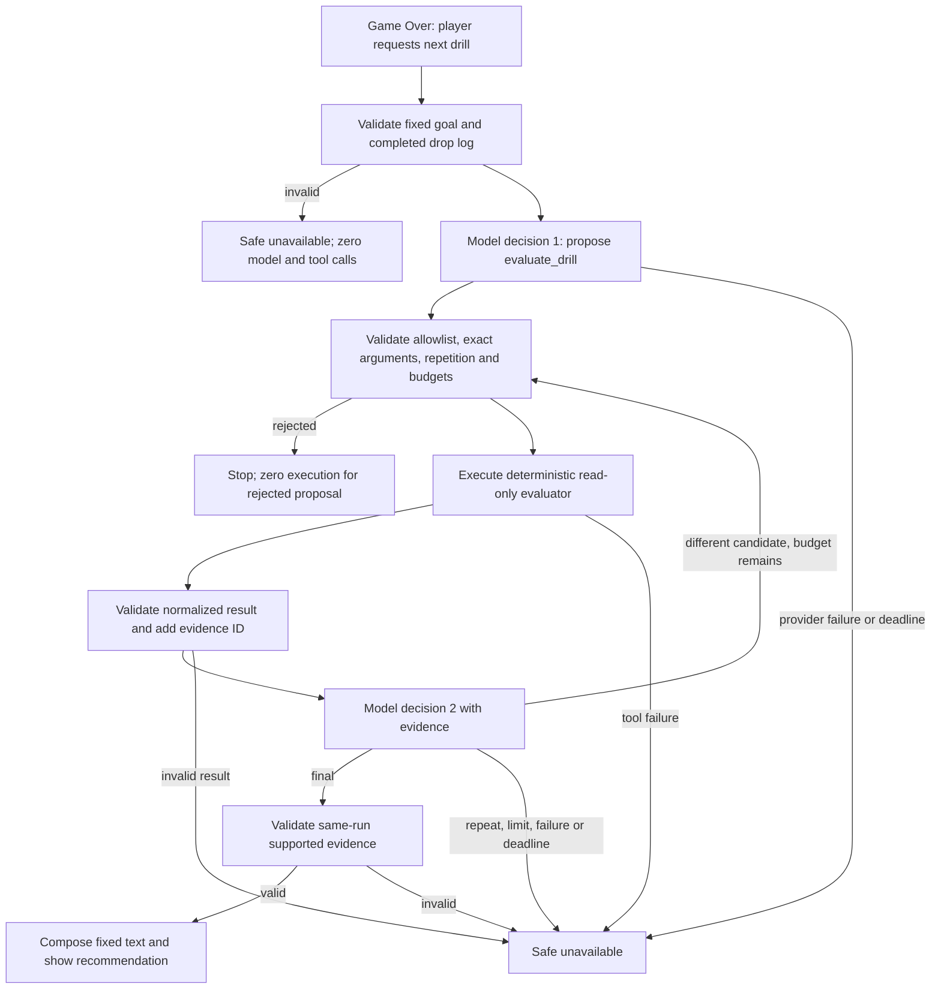

# Next Drill Agent Flow

The server, not the model, decides whether a proposed action may execute. Maximums are three model steps, two tool calls, four provider attempts, and 25 seconds per logical run. A provider retry does not add an agent step. No chain-of-thought is exposed or logged.
